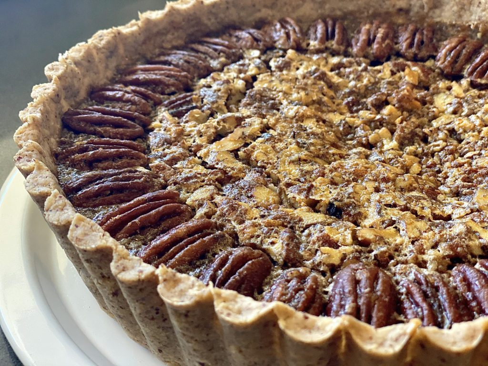

```{r setup, include=FALSE}
knitr::opts_chunk$set(echo = TRUE)
```

```{r, echo=FALSE}
knitr::include_graphics("Lordvoldemort.jpg")
```

A quote by Lord Voldemort:

> "There is no good and evil. There is only power and those too weak to seek it."


|Description|Value|
|:------|:------|
|Blood status|Half-blood|
|Marital status|Single|
|Title(s)|Prefect, Head Boy, Dark Lord, Heir of Slytherin|
|Species|Human|

***

# "Old-Fashioned" Pecan Pie: Reloaded
```{r, echo=FALSE}

```

[Link to recipe](https://altonbrown.com/recipes/bourbon-pecan-pie/)

## Ingredients
### Crust
* 4 tablespoons unsalted butter, cut into small cubes
* 3 1/2 ounces raw pecans
* 6 ounces all-purpose flour (approximately 1 1/4 cups by volume...not that we can trust that[^1]), plus extra for rolling
* 1/2 teaspoon kosher salt
* 2 tablespoons ice water
* 2 tablespoons rye whiskey, chilled

### Filling
* 3 large eggs
* 3 1/2 ounces granulated sugar
* 6 fluid ounces golden syrup
* 4 tablespoons unsalted butter, melted and cooled slightly
* 1 tablespoon rye whiskey
* 1/2 teaspoon Angostura cocktail bitters (20 dashes)
* 1 teaspoon vanilla extract
* 1/4 teaspoon kosher salt
* 8 ounches spiced pecans, divided

### Specialized Hardware
* Food processor
* 9 1/2 x 2-inch tart pan

## Procedure
*Chill* the butter in the freezer for 15 minutes.

*Pulse* the raw pecans in a food processor until finely ground, 6 to 7 pulses. Add the flour and salt, and pulse an additional 4 to 5 times. Add the chilled butter and pulse until the texture looks mealy, 6 to 7 pulses. Add the water and 2 tablespoons of rye, and pulse until the mixture holds together when squeezed in the hand, 5 to 6 more pulses. Transfer the dough to a 1 gallon zip-top bag, squeeze together with your hands until it forms a ball, then press into a rounded disk and refrigerate for 30 minutes.

*Heat* oven to **350ºF**.

*Whisk* the eggs, sugar, golden syrup, butter, rye whiskey, the bitters, vanilla, and salt together in a medium mixing bowl until combined and set aside.

Remove the dough from the refrigerator. Cut along two sides of the zip-top bag, open the bag to expose the dough, and sprinkle both sides lightly with flour. Cover with the bag and roll out with a rolling pin to an 11-inch circle. Open the bag and lift the dough into a 9 1/2 x 2-inch tart pan. Gently press the dough into the pan, working it halfway up the side.

Chop 6 ounces of the spiced pecans, sprinkle them evenly into the crust, then pour on the filling. Bake in the middle of the oven for 20 minutes.

Remove the pie from the oven and close the door. Place the remaining 2 ounces of whole spiced pecans in a border around the edge of the filling then return to the oven for 15 more minutes or the internal temperature reaches 200 F and no longer jiggles loosely in the center.

*Cool* the pie on a wire rack for an hour before cutting and serving at room temp, possibly topped with our Slightly Sweet Whipped Cream.

To store, tightly wrap the remaining pie with plastic wrap and place in the refrigerator for up to 4 days. (Honestly, I haven't been able to make one last more than 9 hours, but feel free to beat me on that.)

[^1]: Here is an example of a footnote.

***

In algebra, a **quadratic equation** (from Latin *quadratus 'square'*) is any equation that can be rearranged in standard form as

$ax^2 +bx+c = 0,$

where $x$ represents an unknown value, and $a, b$, and $c$ represent known numbers, where $a\neq 0$. (If $a=0$ and $b\neq 0$ then the equation is linear, not quadratic.) The numbers $a,b,$ and $c$ are the *coefficients* of the equation and may be distinguished by respectively calling them, the *quadratic coefficient*, the *linear coefficient* and the *constant coefficient* or *free term*.

The values of $x$ that satisfy the equation are called solutions of the equation, and *roots* or *zeros* of the expression on its left-hand side. A quadratic equation has at most two solutions. If there is only one solution, one says that it is a double root. If all the coefficients are real numbers, there are either two real solutions, or a single real double root, or two complex solutions that are complex conjugates of each other. A quadratic equation always has two roots, if complex roots are included; and a double root is counted for two. A quadratic equation can be factored into an equivalent equation

$ax^2 + bx + c = a(x-r)(x-s) = 0$

where $r$ and $s$ are the solutions for $x$.

The quadratic formula

$x = \dfrac{-b \pm \sqrt{b^2-4ac}}{2a}$

expresses the solutions in terms of $a,b,$ and $c$. Completing the square is one of several ways for deriving the formula.

Solutions to problems that can be expressed in terms of quadratic equations were known as early as 2000 BC.

***

# Data Dictionary for waterbottles sold by REI

* `Best Use` : type(s) of activity best suited for this water bottle (e.g., Multisport). Datatype: `character`. Missing values stored as `Unavailable`.
* 'Liquid Capacity' : maximum amount of liquid volume possible in liters. Datatype: `double` or `real`. Missing values stored as `Unavailable`.
* `Dimensions` : Length, width, height, of the water bottle, in inches. Datatype: `integer`, `double`, or `real`. Missing values stored as `Unavailable`.


