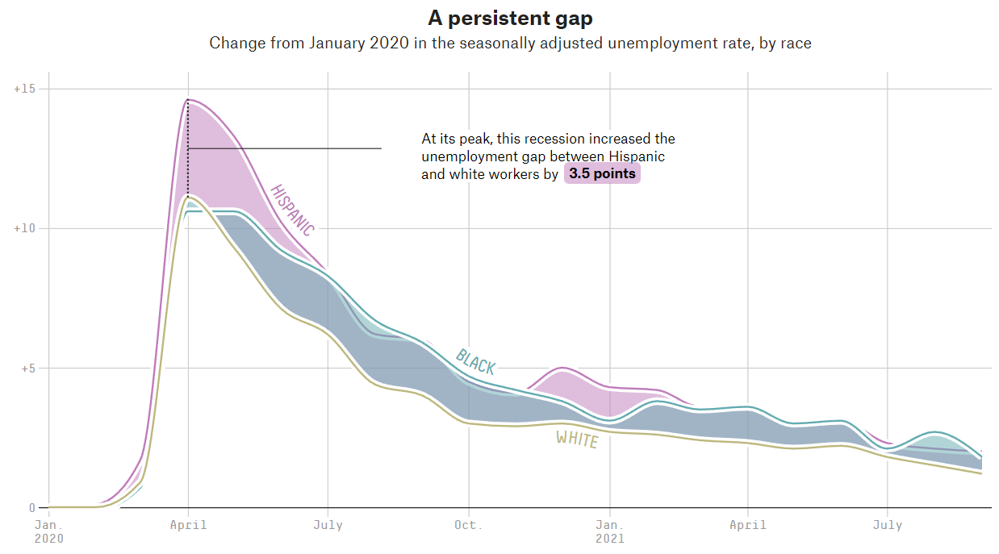

```{r setup, include=FALSE}
knitr::opts_chunk$set(echo = TRUE)
library(tidyverse)
library(lubridate)
library(scales)
```

# {.tabset .tabset-fade .tabset-pills}
## 1) Look for a Graphic

a. A screenshot of the graphic:

```{r out.width='95%', echo = FALSE, fig.align='center'}

```

b. ["How Fast Is The Economy Recovering?"](https://projects.fivethirtyeight.com/us-economy-coronavirus/)
Authors: Julia Wolfe, Amelia Thomson-DeVeaux

c. Description/explanation of the graphic's context:

* The horizontal axis represents time and has tick marks at the start of every 3 months. The vertical axis represents the seasonally adjusted unemployment rate, by race in the U.S.
* This graphic visualizes data roughly between January 2020 and October 2021.
* This graphic consists of three timeseries graphs.
* This graphic is static. There is no interactive component or animation.

d. A pink or lavender rose (#BF7CBB) is used for the hispanic unemployment rate. Similarly a dark teal (#63ABB0), and metallic yellow (#BCB87D) are used for the black and white unemployment rates respectively. Note that the area underneath each of the lines have a similar color and their opacity is less than 1. For some portions of the graph this results in a mixing of color.

e. The graph is mostly colorblind friendly but those with deuteranopia may have trouble distinguishing the hispanic and black unemployment rate colors.

f. The graphic has a data-ink ratio very close to 1. Every element of the graphic conveys a sufficient amount of information for the purpose of the article. The filled in areas help emphasize which groups had relatively higher unemployment rates at different points in time. The gridlines and other less significant elements use lighter colors to stay in the background.

g. The text that points toward the maximum unemployment rate gap between Hispanic and white workers has a vertical dotted line to very clearly explain where and what the gap is. I also noted that there is a very thin white border between each of the timeseries lines, making them visually more distinguished, but without adding more visual clutter if they used a thin black border.

## 2) Electricity Usage Graph

### 2.1) Graphic's Assessment

The bar-chart does a good job at showing how the weather correlates with electricity usage. The bar-chart does a good job at drawing attention to days when relatively more electricity is used. The vertical line showing when the month of September starts is visually helpful.

There is no axis or tick marks for the weather variable. It's not a good idea to have the temperature labels change colors throughout the bar-chart. Also, those with protanopia or deuteranopia may have trouble distinguishing between the weather and electrcity usage colors.

### 2.2) Graphic Replication
```{r fig.width=12, fig.height=8}
# PG&E Data
Date = seq(as.Date("2021-08-27"), as.Date("2021-09-27"), by="days")
Usage = c(4.3, 5, 7, 3.8, 5.6, 2.6, 4.8, 3.2, 2.6, 5.1, 3.3, 3.9, 2.5, 7.1, 3, 2.2, 6.1, 3.2, 3.2, 3.9, 5.6, 3.4, 3.3, 3.3, 4.4, 5.3, 2.9, 7.1, 3.3, 2.5, 3.1, 4.5)
Weather = c(70, 71, 65, 63, 62, 63, 62, 61, 61, 62, 67, 66, 67, 64, 64, 64, 65, 65, 62, 61, 62, 63, 64, 65, 68, 72, 65, 63, 63, 62, 62, 65)
pge = data.frame(Date, Usage, Weather)


pge %>% ggplot() +
    geom_vline(xintercept=as.Date("2021-09-01")-0.51, col="#E5E5E5",show.legend=FALSE) +
    geom_col(aes(x = Date, y = Usage, color = 'Electricity Usage from Grid'), fill = '#3B86BE') +
    scale_x_date(breaks = seq(as.Date("2021-08-27"), as.Date("2021-09-27"),4),
                 date_labels = "%a \n %e") +
    scale_y_continuous(labels = number_format(accuracy = 0.1), limit =c(0,8))+
    coord_cartesian(expand = FALSE) +
    geom_line(aes(x = Date, y = (Weather-30)/8, color='Weather (°F)'), linewidth = 1.5, show.legend=TRUE) +
    geom_text(aes(x = Date, y = (Weather*c(1,NA)-30)/8, label = paste(Weather,"°",sep = "")),
               color = "#891D95",
               size = 3,
               show.legend = FALSE,
               check_overlap = TRUE,
               na.rm = TRUE,
               nudge_y = 0.5,
               nudge_x = 0.125) +
    theme(
        aspect.ratio=0.305,
        axis.title.x = element_blank(),
        axis.title.y = element_blank(),
        panel.background = element_blank(),
        panel.border = element_blank(),
        panel.grid.major = element_line(color = "#E5E5E5"),
        panel.grid.major.x = element_blank(),
        panel.grid.minor = element_blank(),
        plot.margin = unit(c(1,1,1,1),"cm"),
        plot.background = element_rect(fill = "#F1F1F1"),
        plot.title = element_text(family="sans",
                                  colour="#585858",
                                  hjust=0.5,
                                  size=10),
        legend.position = "bottom",
        legend.title = element_blank(),
        legend.background = element_blank(),
        legend.text = element_text(colour="#585858")
        ) +
    labs(title="< Aug 27, 2021 - Sep 27, 2021 >") +
    scale_color_manual(breaks=c('Weather (°F)', 'Electricity Usage from Grid'),
                       values=c('Weather (°F)'='#891D95','Electricity Usage from Grid' ='#3B86BE'))
    
    
    

```


## 3) Visualizing Household Expenditures

```{r}
dat = read_csv(
    file = "expenses.csv",
    col_types = list(
        concept = col_character(),
        amount = col_double(),
        date = col_date(format = "%m/%d/%y"),
        category = col_character(),
        mode = col_character()
        )
    )
```

### 3.1) Data Visualizations

a. Create a visual display that lets us see the total monthly expenditures over the provided months/years.

```{r}
tme <- group_by(dat, month = lubridate::floor_date(date, "month")) %>% 
    summarize(expenditure = sum(amount))
ggplot(tme) +
    geom_line(aes(x = month, y = expenditure), linewidth=1) +
    scale_y_continuous(breaks = seq(0,11000,1000),
                       labels = number_format(prefix="$",big.mark = ","),
                       limit = c(0,11000)
                       ) +
    scale_x_date(date_breaks = "3 month",
                 date_labels = "%b\n%y"
                 ) +
    coord_cartesian(expand = FALSE) +
    theme(
        plot.title = element_text(hjust=0.5, size=20),
        plot.background = element_blank(),
        panel.grid.minor = element_blank(),
        panel.background = element_blank(),
        panel.grid.major = element_line(color = "#E5E5E5"),
        axis.title = element_blank()
        ) +
    labs(title="Total Monthly Expenditures")
```

b. Create a visualization to display the top-5 annual expenditure categories in every year.

```{r}
yearly_exp <- group_by(dat, year = lubridate::floor_date(date, "year")) %>% 
    group_by(category, .add=TRUE) %>% 
    summarise(
        expenditure = sum(amount),
        .groups = "keep"
    )

exp18 <- arrange(filter(yearly_exp, year=="2018-01-01" & category != "debt"), desc(expenditure))
exp19 <- arrange(filter(yearly_exp, year=="2019-01-01"), desc(expenditure)), n =5)
exp20 <- arrange(filter(yearly_exp, year=="2020-01-01"), desc(expenditure)), n =5)
exp21 <- arrange(filter(yearly_exp, year=="2021-01-01"), desc(expenditure)), n =5)
exp22 <- arrange(filter(yearly_exp, year=="2022-01-01"), desc(expenditure)), n =5)

# df <- data.frame(
#     top18$category,
#     top19$category,
#     top20$category,
#     top21$category,
#     top22$category)
# names(df) <- seq(2018,2022,1)
# view(df)
```

c. Create a plot that lets us compare, over time, the cost-of-living spending versus the discretionary spending.
